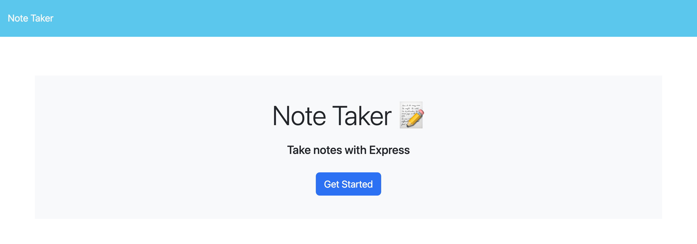
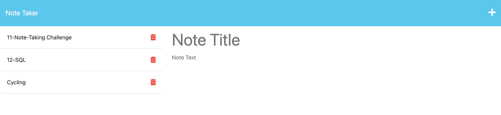
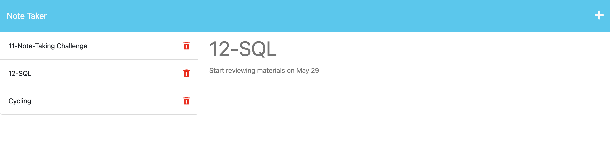
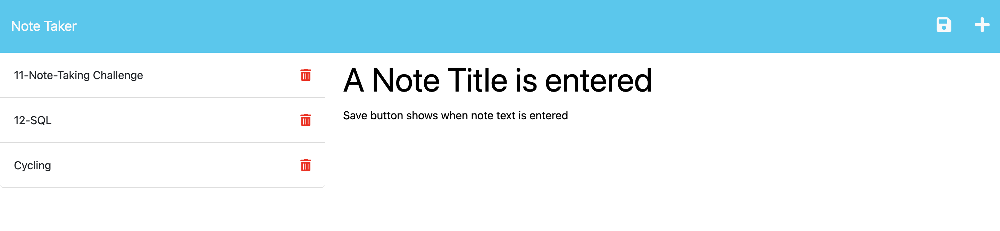
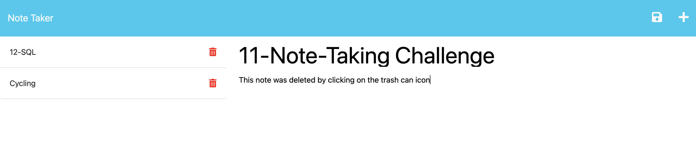

# 11-Note-Taking

## License
&nbsp;

* Select the badge to see details.
* To see more about license badges, visit [Shields IO](https://shields.io/category/license)

&nbsp;

## Description
The purpose of this project was to create an app that could be used for making notes about thoughts or reminders of tasks that needed to be done.

&nbsp;

## Table of Contents

 * [Usage](#usage)
 * [Media](#media)
 * [Testing](#testing)
 * [Contribution](#contribution)
 
 &nbsp;

## Usage

Currently the application is used in a local environment. Clone the repository.
1. Open the starter.js file in a new terminal.
2. Type in node starter.js and hit the enter care to open a port for the server.
3. Right click on the index.html file and open it in the browsers.
4. Select the start button to open the notes page.
5. Enter a note title and note text.
6. In the top right, click the save icon and the note will be saved to the left. You can then enter another note.
7. To view notes you may have previously entered, select the note.
8. To add another note, select the + icon in the top right.
9. To delete a previously saved note, select the trashcan icon.

&nbsp;

[Table of Contents](#table-of-contents)

## Media
_A brief overview of the project build_
&nbsp;

&nbsp;

&nbsp;

&nbsp;

&nbsp;

* Visit [Heroku](https://challenge-11-note-taking.herokuapp.com/) to see more details

&nbsp;

[Table of Contents](#table-of-contents)

## Testing

Follow the instructions on how to use the application.

&nbsp;

[Table of Contents](#table-of-contents)

## Contribution

No information

&nbsp;

[Table of Contents](#table-of-contents)

## Questions

_If you have any questions, please feel free to contact me._

GitHub Username: [waynefenwick](https://github.com/waynefenwick)

Email Address: <a href="mailto:waynefenwick@gmail.com">waynefenwick@gmail.com</a>

&nbsp;

_Thanks for taking time to visit this repository!_

[Back to Top](#)

